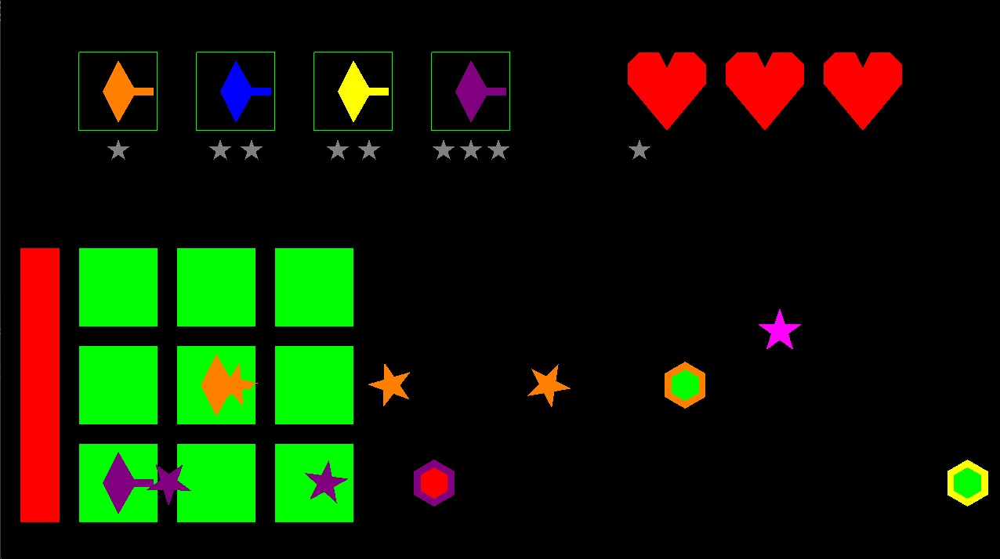
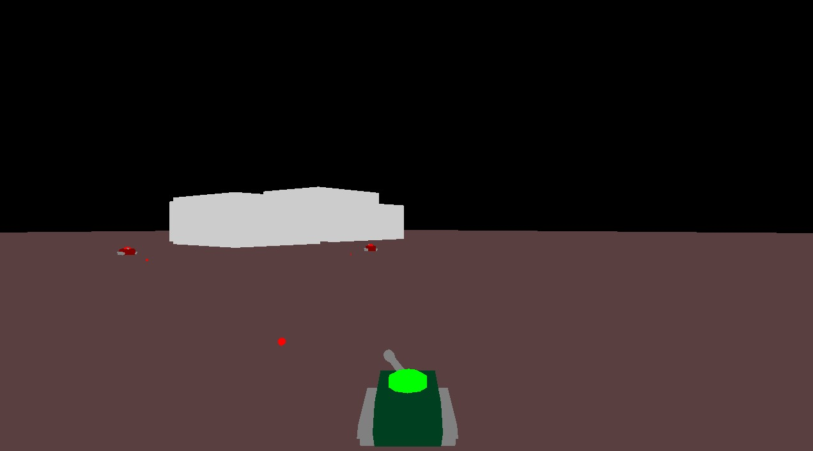

# GFX Framework Games

## Introduction

**!!! IMPORTANT NOTE !!!** The project consists of 2 video-games developed in C++ using GFX-Framework. However, only the "tema1" **(Squares vs Zombies)**, and "tema2" **(World of Tanks Remake)** directories are *my work*!
They were developed around the **GFX-Framework** created by the **Computer Graphics Department** of the *Polytechnic University of Bucharest*, and stood as my two homeworks for the Computer Graphics course.
The following details regarding installation, setup and licenses have been provided by the Computer Graphics Department.
Sections *Squares vs Zombies* and *World of Tanks Remake* shortly describe the two games developed by me.

The code is cross-platform, and supports the following architectures:

-   Windows: `i686`, `x86_64`, `arm64`
-   Linux: `i686`, `x86_64`, `arm64`
-   macOS: `x86_64`, `arm64`

## Game descriptions

### Squares vs Zombies



*Squares vs Zombies* is a 2D game similar to the well-known Plants vs Zombies. The player screen presents a 3x3 grid where the player can place "turrets" by dragging and dropping them from the shop to the selected square in the grid.
Each turret's price is displayed right below it. On the upper right side, the player's currency is displayed, which is obtained by clicking on the randomly spawning pink stars.
On each of the 3 lines, enemies are coming from the right side of the screen, trying to reach the left side and thus depleting the player's health points. The player can eliminate them by placing turrets of the corresponding color on the respective line.

### World of Tanks Remake



*World of Tanks Remake* is a 3D single-player 1v5 game. The player's goal is to defeat all 5 enemy tanks within a given time, by shooting at them. The tank moves using the WASD keys, while its turret moves by moving the mouse. The player can shoot by pressing the left mouse button, but enemies can shoot at the player too! Their behaviour is random, described by a "state machine" (they either move, rotate their body or shoot). The tank models were designed using *Blender*, and their shape is slightly altered with each hit.
The game ends when the player defeats all of the enemies, or when the player loses its 5 health points. At the end, scoring is displayed in the terminal window depending on the outcome of the fight.

## Prerequisites

This section describes ***what you need to do and install*** before actually building the code.


### Install a compiler

The compiler requirements are listed below. We strongly recommend to always use the latest compiler versions.

-   Minimum:
    -   Windows: Visual Studio 2015 Update 3 with `Programming Languages -> Visual C++` checked when installing
    -   Linux: `g++` version 5
    -   macOS: `clang++` version 4

-   Recommended:
    -   Windows: Visual Studio 2019 with `Workloads -> Desktop development with C++` checked when installing
    -   Linux: `g++` latest
    -   macOS: `clang++` latest, by doing one of the following:
        -   for LLVM/Clang: install [`brew`](https://brew.sh/) then run `brew install llvm`
        -   for Apple Clang: install XCode


### Check your graphics capabilities

Graphics capabilities are decided by the combination of your computer's hardware, drivers, and operating system.

This project requires OpenGL version ***3.3 core profile, or newer*** for the simpler parts, and version ***4.3 core profile, or newer***  for the more advanced parts. If you have a computer manufactured within the last few years, you should be safe. ***If you're not sure,*** follow the steps in [this guide](docs/user/checking_capabilities.md) to find out.


### Install the third-party libraries

There are some open-source libraries that this project uses. To install them:

-   Windows: you don't need to do anything - all necessary libraries are already provided with the code

-   Linux: depending on your distribution, run one of the following scripts as superuser:
    -   Debian (Ubuntu): `./tools/deps-ubuntu.sh`
    -   Red Hat (Fedora): `./tools/deps-fedora.sh`
    -   Arch (x86_64): `./tools/deps-arch.sh`

-   macOS: install [`brew`](https://brew.sh/) then run `./tools/deps-macos.sh`


### Install the build tools

This project uses [CMake][ref-cmake]. It a nutshell, CMake does not compile source code, instead it creates files that you then use to compile your code (for example, it creates a Makefile on Linux and macOS, a Visual Studio project on Windows, and so on).

This project requires CMake ***3.16 or newer,*** however, as with the compilers, we strongly recommend that you use the latest version. To install it, follow these steps:

-   Windows:
    1.  go to the [CMake downloads page][ref-cmake-dl]
    2.  download the latest version of the file called `cmake-<VERSION>-windows-x86_64.msi`
    3.  install it

-   Linux:
    1.  use your package manager to install `cmake`
    2.  check the version using `cmake --version`
    3.  depending on the version:
        -   if it's the minimum required (see above), you're all set
        -   otherwise, run `./tools/install-cmake.sh && . ~/.profile` in a terminal

-   macOS:
    1.  run `brew install cmake`

After installation, run `cmake --version` (again) to check that it's in your `PATH` environment variable. This should happen automatically, but if it didn't, just add it manually. Instructions on how to add an executable to your `PATH` differ across operating systems and are ***not*** covered here.


## Building

Open a terminal and go into the root folder of the project, which contains the top-level `CMakeLists.txt` file.
Do not run CMake directly from the top-level folder (meaning, do not do this: `cmake .`). Instead, make a separate directory, as follows:

1.  `mkdir build`
2.  `cd build`
3.  Generate the project:
    -   for module 1 labs (default, where games where implemented): `cmake ..`
4.  Build the project:
    -   Windows, one of the following:
        -   `cmake --build .`
        -   or just double-click the `.sln` file to open it in Visual Studio, then press `Ctrl+Shift+B` to build it
    -   Linux and macOS, one of the following:
        -   `cmake --build .`
        -   or just `make`

That's it!


### Rebuilding

It's very simple to rebuild:

-   Every time you modify source code and want to recompile, you only need to follow ***the last step*** (for example, just `make` again)
-   Every time you add/remove/rename a source code file on disk, you need to follow ***the last two steps*** (for example, just `cmake .. && make` again)
-   If something goes wrong when generating the project, just delete the contents of the `build` folder, or the folder itself, then follow all the steps again


## Running

You can run the project from an IDE, as well as standalone, from anywhere on disk. For example:

-   Windows, one of the following:
    -   `.\bin\Debug\GFXFramework`
    -   or just open the `.sln` file in Visual Studio, then press `F5` to run it

-   Linux and macOS:
    -   `./bin/Debug/GFXFramework`

To run a certain game:

-   Go into `main.cpp`
-   Find this line:
    ```cpp
    World *world = new gfxc::SimpleScene();
    ```
-   Replace it with whatever you want to run, for example:
    ```cpp
    World *world = new m1::Tema1(); // To play "Squares vs Zombies"
    World *world = new m1::Tema2(); // To play "World of Tanks Remake"
    ```

## License

This project is available under the [MIT][ref-mit] license; see [LICENSE.md](LICENSE.md) for the full license text.
This project also includes external libraries that are available under a variety of licenses; see [LEGAL.txt](LEGAL.txt)
for the full license texts and legal notices.


[ref-cmake]:            https://github.com/Kitware/CMake/
[ref-cmake-dl]:         https://github.com/Kitware/CMake/releases/
[ref-cmake-build]:      https://github.com/Kitware/CMake#building-cmake-from-scratch
[ref-mit]:              https://opensource.org/licenses/MIT
